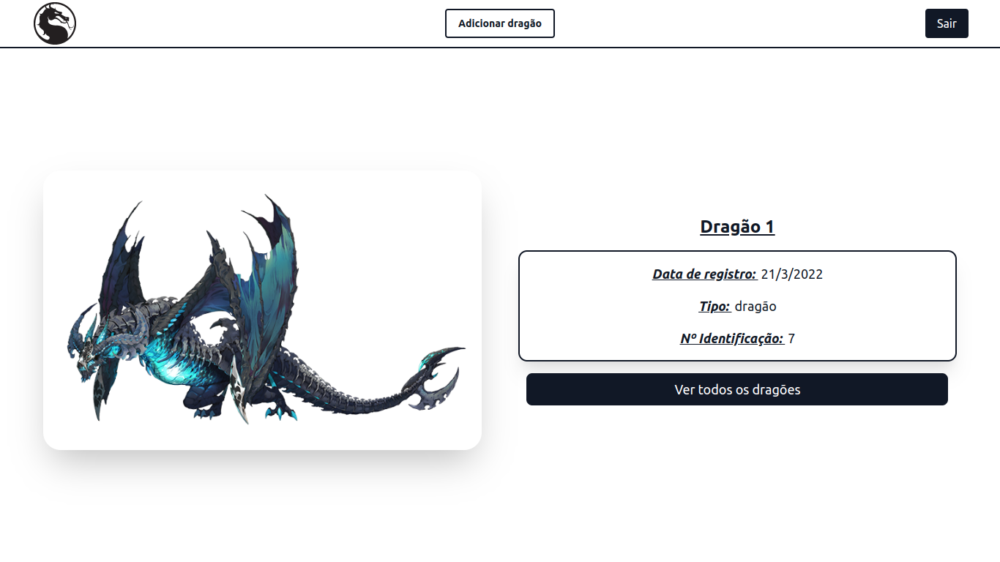
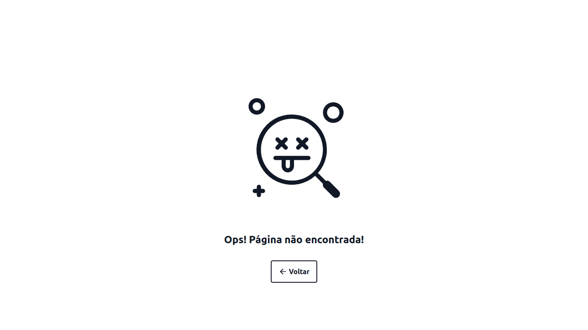
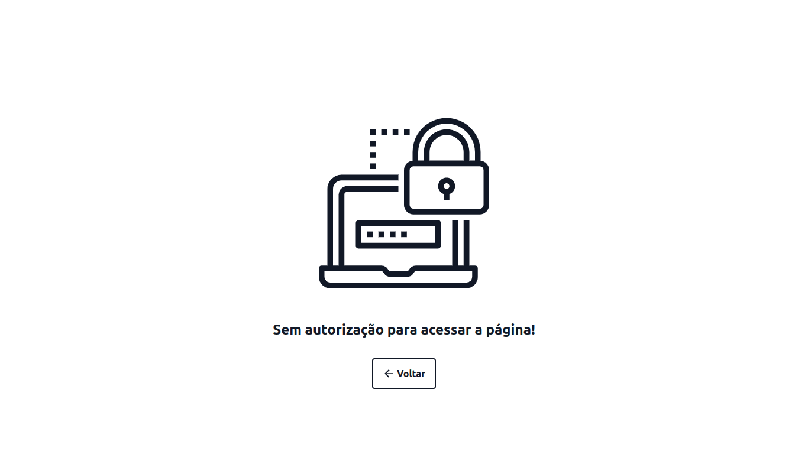
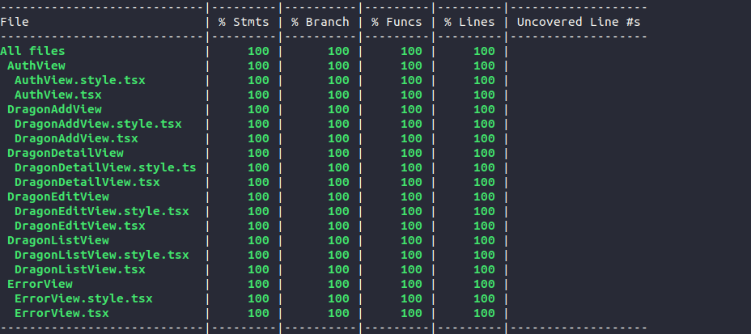

# React Dragons

## Resumo do projeto

O projeto consiste em uma aplicação que contém sistema de login e cadastro, uma lista de dragões, onde a partir desta você pode ver mais detalhes do mesmo, editá-lo e/ou deletá-lo, e também no header há a opção de adicionar um novo dragão. A seguir entrarei em detalhes sobre cada parte do projeto.

## Tecnologias/bibliotecas utilizadas

- ReactJS
- Typescript
- Firebase
- Firebase hooks
- Express
- React Router
- Styled Components
- TailwindCSS
- twin.macro
- React Hook Form
- Yup
- Webpack
- Babel
- React Testing Library
- Jest

## Páginas e/ou telas da aplicação:

### *Página de autenticação*

Ao entrar pela primeira vez no site, o usuário verá o formulário de login, caso não tenha conta, pode clicar no link “Clique aqui!”. Ao fazer isso, uma animação ocorrerá e o formulário de cadastro ficará visível. Além disso, tem a opção de entrar por meio do sistema OAuth 2 com uma conta do google.

Vale salientar que para o sistema de autenticação foi utilizado o Firebase juntamente com React Firebase Hooks.

Tanto o formulário de login, quanto o de cadastro são validados com a combinação do React Hook Form e da biblioteca Yup. Com isso o usuário recebe um feedback se os campos preenchidos cumprem os requisitos, se a conta foi criada com sucesso e/ou se o email colocado já tem uma conta cadastrada. Caso o login seja realizado, o usuário é automaticamente redirecionado para a lista de dragões.


https://user-images.githubusercontent.com/67431433/165098928-65dcbc17-5208-4fba-a3f4-13f04c6ff2ca.mp4


### *Layout padrão*

O layout padrão presente nas funcionalidades da aplicação quando o usuário está autenticado consiste num header que apresenta a logo do projeto, um botão que redireciona para a página de adicionar um dragão, e um botão para fazer a desautenticação.

### *Lista de dragões*

Esta página mostra todos os dragões vindos da API, individualizados em um card que contém:

- Nome
- Foto (padrão para todos pois a API disponibilizada não fornece imagem)
- Botão “Ver mais detalhes” que redireciona para os detalhes do dragão
- Botão “Editar” que redireciona para a tela de editar alguns dados do dragão
- Botão “Deletar”

Vale salientar que logo abaixo do header tem uma barra de pesquisa, que a cada caractere inserido nela, a lista é filtrada de acordo com o texto do usuário.

Além disso, se nenhum dragão estiver cadastrado e/ou nenhum dragão corresponder ao filtro da barra de pesquisas, a mensagem "Nenhum dragão encontrado!” será exibida no lugar da lista.


https://user-images.githubusercontent.com/67431433/165098983-c9c2ba81-a13f-4fcd-a1da-95338a24d373.mp4


### *Página de detalhes do dragão*

Esta página mostra os seguintes dados do dragão:

- Nome
- Tipo
- Nº de identificação
- Foto

Também há o botão “Ver todos os dragões” que redireciona para a lista de dragões.



### *Página de editar dragão*

Esta página apresenta um formulário com os campos “Nome” e “Tipo” do dragão, ambos já iniciam preenchidos com os dados do dragão a ser editado.

O formulário é validado com **React Hook Forms** e **Yup**, que tornam ambos os campos obrigatórios.

Caso o formulário seja submetido (por meio da tecla *enter* ou clicando no botão “Salvar”), aparecerá a mensagem de sucesso “Dados alterados com sucesso” durante 3 segundos.

Por fim, há o botão “Voltar” que redireciona para a lista de dragões.


https://user-images.githubusercontent.com/67431433/165099048-ca239d23-07cf-4e52-9a17-0b22d7746a8f.mp4


### *Página de adicionar dragão*

Esta página apresenta um formulário com os campos “Nome” e “Tipo” do dragão.

O formulário é validado com **React Hook Forms** e **Yup**, que tornam ambos os campos obrigatórios.

Caso o formulário seja submetido (por meio da tecla *enter* ou clicando no botão “Adicionar”), aparecerá a mensagem de sucesso “Dragão adicionado com sucesso!” durante 3 segundos.

Por fim, há o botão “Voltar” que redireciona para a lista de dragões.


https://user-images.githubusercontent.com/67431433/165099181-7800d097-37bc-4784-857e-c5ff7a0061b9.mp4


### *Página Not Found*

Ao ser redirecionado para essa página, o usuário verá uma mensagem informando que a pesquisa dele não corresponde a nenhuma funcionalidade da aplicação, em seguida é disponibilizado um botão para voltar para a rota padrão (”/”).



### *Página Not Authorized*

Ao ser redirecionado para essa página, o usuário verá uma mensagem informando que ele não tem autorização para acessar tal funcionalidade da aplicação, em seguida é disponibilizado um botão para voltar para a rota padrão (”/”).



### *Tela Loading*

Essa tela será mostrada em momentos cuja a aplicação está carregando dados, como por exemplo na requisição da lista de dragões, ou nos detelhes de algum dragão específico.


https://user-images.githubusercontent.com/67431433/165099219-876631d7-3e81-464a-9e1b-72c3e7bc55bd.mp4


## Rotas Protegidas

As rotas da aplicação estão disponíveis conforme o estado do usuário (autenticado ou não). 

O que determina se o usuário está logado ou não é a presença de um token no localstorage, esse token é automaticamente criado e salvo quando o login é feito (com email e senha ou por meio do google)

### *Para usuários não autenticados:*

- Página padrão ( **/** ) → redireciona para a rota /auth
- **/auth** → mostra a página de autenticação
- **/dragons** e qualquer outra relacionada com **/dragon**→ redireciona para a rota /not-authorized
- **/not-found** → mostra a página Not Found
- **/not-authorized** → mostra a página Not Authorized
- Qualquer outra url →redireciona para /not-found

### *Para usuários autenticados:*

- Página padrão ( **/** ) → redireciona para a rota /dragons
- **/auth** → redireciona para a rota /dragons
- **/dragons** → mostra a página Lista de Dragões
- **/dragon/:id →**mostra a página de detalhes do dragão com o id correspondente, se não houver dragão com tal id, mostra a página Not Found
- **/dragon/edit/:id →**mostra a página de editar do dragão com o id correspondente, se não houver dragão com tal id, mostra a página Not Found
- **/dragon/add →**mostra a página de adicionar dragão
- **/not-found** → mostra a página Not Found
- **/not-authorized** → mostra a página Not Authorized
- Qualquer outra url →redireciona para /not-found

## TailwindCSS | **twin.macro** + styled components

Para a estilização da aplicação, o objetivo foi juntar os benefícios ofertados pelo TailwindCSS com a organização e css-in-js que o styled components oferta. Para tal integração funcionar da maneira esperada, a biblioteca twin.macro foi utilizada.

## T**estes**

Com React Testing Library e Jest, o projeto foi configurado para fazer uma cobertura de testes para a parte dos views, e nesses componentes componentes a cobertura foi de 100%.



## Webpack

Vale salientar que toda a configuração de desenvolvimento e de build da aplicação foi feita “a mão” com webpack, babel, dentre outras configurações, não tendo sido utilizado ferramentas que preparam o ambiente automaticamente, como por exemplo “create-react-app”.

## Docker

No projeto há presente um Dockerfile, para a correta execução siga os seguintes passos:

- Instalar e configurar o Docker na sua máquina.
- Com o terminal aberto na pasta root do projeto, rode o comando:

```jsx
docker build -f Dockerfile -t react-dragons .
```

- Após terminar o processo de build, execute o seguinte comando para rodar a versão de produção do projeto na porta 3000 do localhost:

```jsx
docker run -p 3000:3000 react-dragons
```

- Agora a aplicação estará disponível na porta 3000 do seu localhost.

## Deploy

Foi feito deploy da aplicação no Heroku por meio do HerokuCLI com Docker, você pode conferir o resultado clicando [aqui](https://react-dragons.herokuapp.com/), ou por meio do link: [https://react-dragons.herokuapp.com/](https://react-dragons.herokuapp.com/)

O primeiro acesso provavelmente demorará pelo fato de que a plataforma da heroku coloca a aplicação em 
"sleep mode" quando não há acessos recorrentes.

Para acessar a aplicação, você pode utilizar as seguintes credenciais:
- Email: sicredi@sicredi.com
- Senha: sicredi2022


## **Enviroment Variables**

### Configuração Firebase (essas informações são concedidas nas configurações do projeto firebase)

*FIREBASE_API_KEY* 

*FIREBASE_AUTH_DOMAIN*

*FIREBASE_PROJECT_ID*

*FIREBASE_STORAGE_BUCKET*

*FIREBASE_MESSAGING_SENDER_ID*

*FIREBASE_APP_ID*

### Aplicação

*REACT_APP_API_PATH* → Caminho para chamada da api, para desenvolvimento recomenda-se colocar a url direto (ex: *www.exemplo.com/api/v1/dragon*), em produção recomenda-se colocar um caminho (ex: /api/dragon) pois um servidor express faz proxy com a API.

*API_URL* → serve apenas para produção, sendo a URL da API que o servidor fará proxy (ex: *www.exemplo.com*)

## Como rodar o projeto

1. Clonar repositório (git clone [https://github.com/dedecanton/desafio-front-dragon.git](https://github.com/dedecanton/desafio-front-dragon.git))
2. Entrar na pasta do projeto
3. Instalar as dependências ( rodar *npm i no terminal do projeto* )
4. Criar arquivo .env no root do projeto, e configurar as variáveis de ambiente.
5. Para rodar em ambiente de desenvolvimento, rode o script *npm run dev*
6. Para rodar em ambiente de produção, rode o script *npm build, em seguida,* *npm start*

## Possível erro com login firebase

Caso você tenha configurado as informações do firebase, porém a funcionalidade de fazer login não está funcionando corretamente, provavelmente o domínio que está rodando a aplicação não tem autorização de autenticação, você pode adicioná-lo à lista de de domínios autorizados na aba “Authentication” no firebase.
